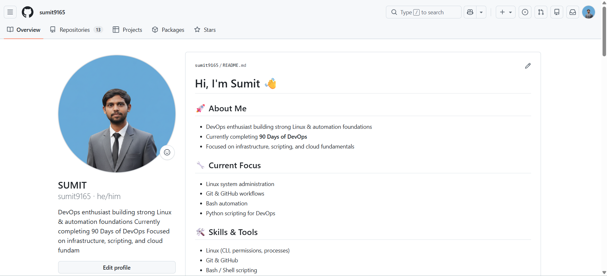

# Day 27 – GitHub Profile Makeover: Build Your Developer Identity

----
- Before Updation of my github profile.

I forget to take a screenshot of my profile before updation.

- After Updation of my github profile.
-----

---------
1. I improved my github repositories with descriptions.
2. I  uploaded my photos and social links.
3. I improved my repositories with `README.MD` file
------------