# Day 31 – Dockerfile: Build Your Own Images

---

# **Task 1: Your First Dockerfile**

### 1. Create project

```bash
mkdir my-first-image
cd my-first-image
```

### 2. Create `Dockerfile`

```dockerfile
FROM ubuntu:latest

RUN apt-get update && apt-get install -y curl

CMD ["echo", "Hello from my custom image!"]
```

### 3. Build image

```bash
docker build -t my-ubuntu:v1 .
```

### 4. Run container

```bash
docker run my-ubuntu:v1
```

###  Verify

You should see:

```bash
Hello from my custom image!
```

---

# **Task 2: Dockerfile Instructions**

### Example project

```bash
mkdir dockerfile-demo
cd dockerfile-demo
echo "This is a test file" > file.txt
```

### Dockerfile using all instructions

```dockerfile
FROM ubuntu:latest

WORKDIR /app

COPY file.txt .

RUN apt-get update && apt-get install -y curl

EXPOSE 8080

CMD ["bash", "-c", "echo Running container && cat file.txt"]
```

### Build & run

```bash
docker build -t demo:v1 .
docker run demo:v1
```

---

### What each instruction does

* **FROM** → base image (starting filesystem)
* **WORKDIR** → sets working directory inside container
* **COPY** → copies files from host → image
* **RUN** → executes commands during build (creates layers)
* **EXPOSE** → documents intended port (no actual publishing)
* **CMD** → default runtime command

---

# **Task 3: CMD vs ENTRYPOINT**

## Case 1: CMD

 **CMD is easily overridden**

---

## Case 2: ENTRYPOINT

 **Arguments are appended to ENTRYPOINT**

---

### Notes (important concept)

* **CMD**

  * Default command
  * Can be overridden at runtime
  * Good for flexible containers

* **ENTRYPOINT**

  * Fixed executable
  * Treats container like a command-line tool
  * Good for enforcing behavior

---

# **Task 4: Build a Simple Web App Image**

### 1. Create project

```bash
mkdir my-website
cd my-website
```

### 2. Create `index.html`


---

### 3. Dockerfile

```dockerfile
FROM nginx:alpine

COPY index.html /usr/share/nginx/html/index.html
```

---

### 4. Build

```bash
docker build -t my-website:v1 .
```

---

### 5. Run

```bash
docker run -d -p 8080:80 my-website:v1
```
---

# **Task 5: .dockerignore**

To confirm:

* Large folders (e.g., `node_modules`) won’t be sent in build context
* Build will be faster
* Image size won’t include ignored files

---

# **Task 6: Build Optimization**


### Notes 

**Why layer order matters:**

* Docker caches each layer
* If a layer changes → all subsequent layers rebuild
* Place:

  * **stable steps first** (dependencies)
  * **frequently changing files last** (source code)

---
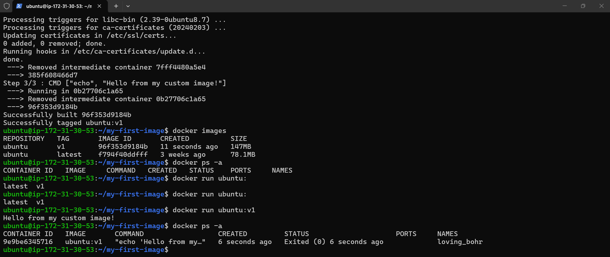 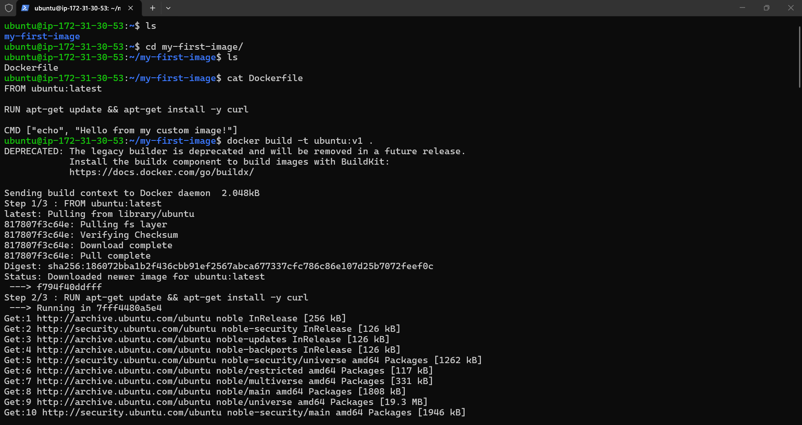 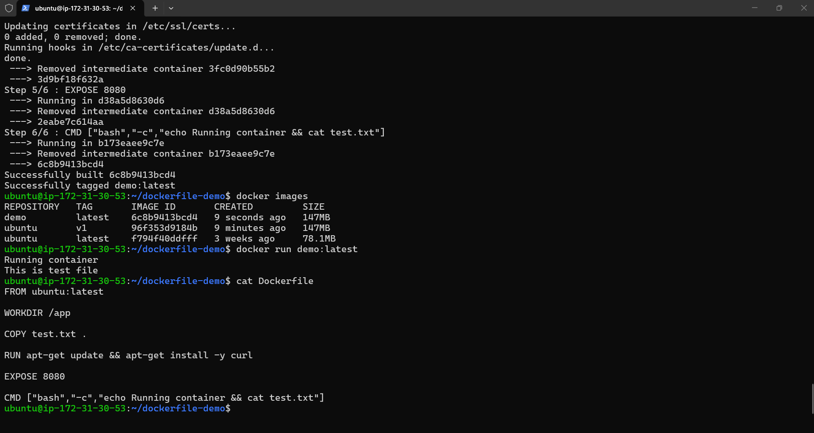 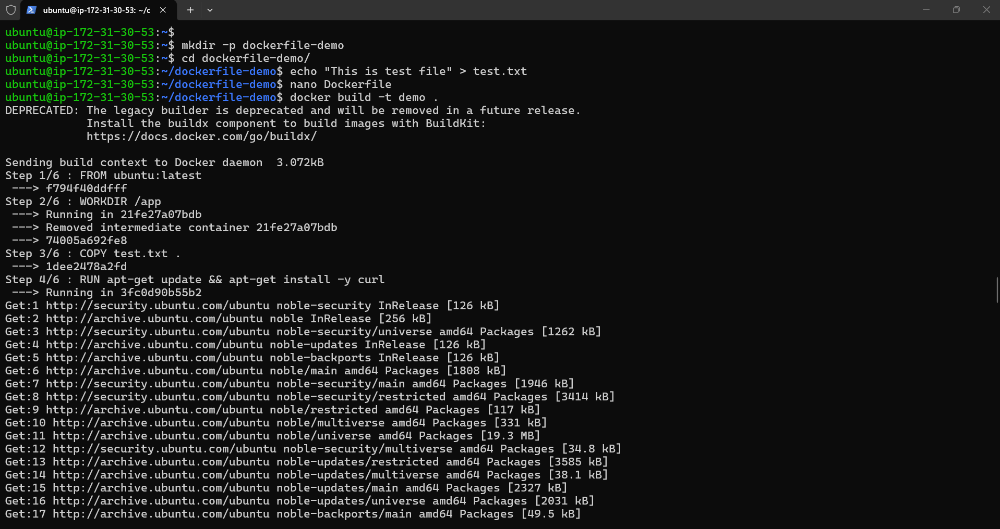 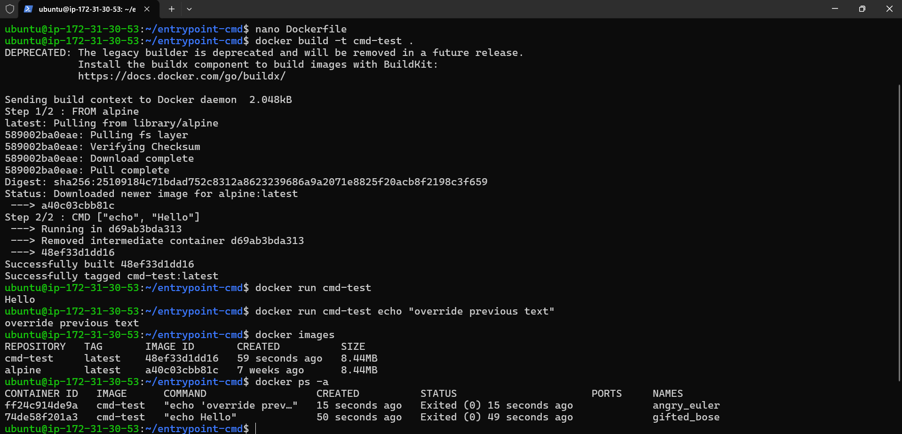 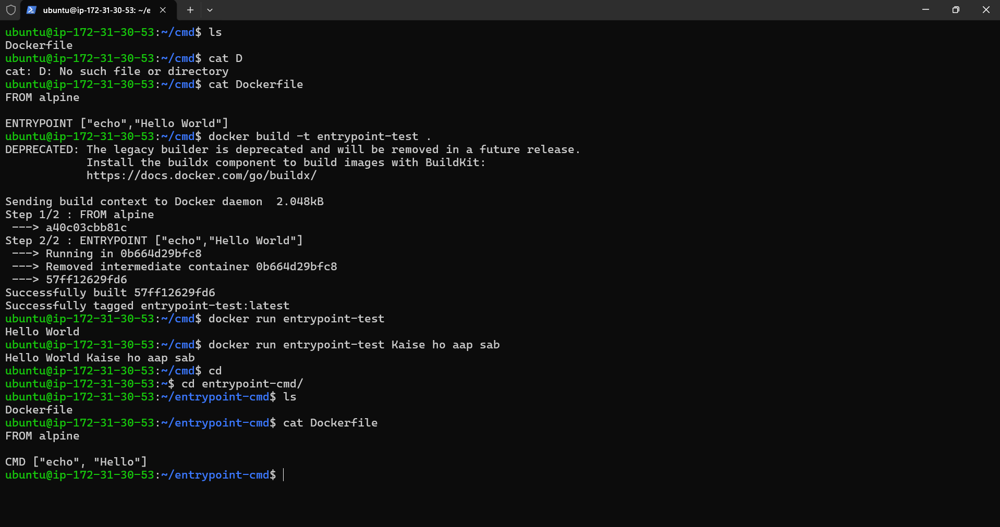 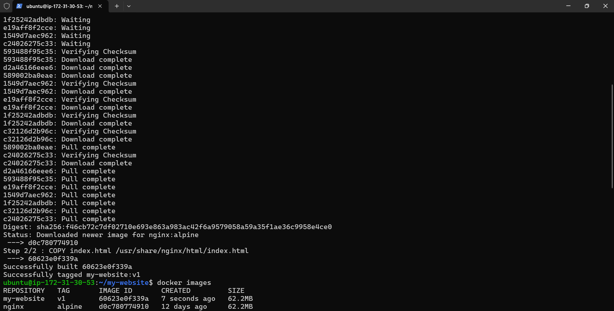 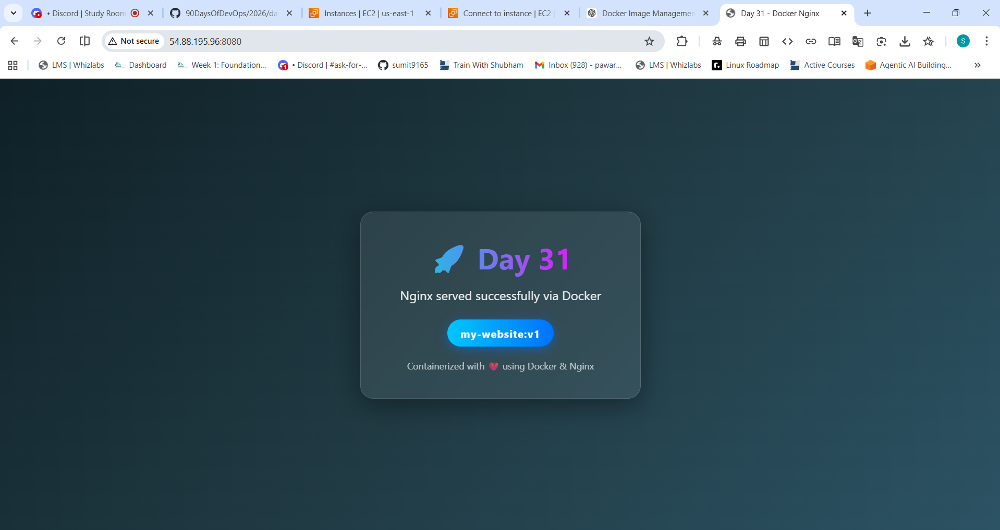 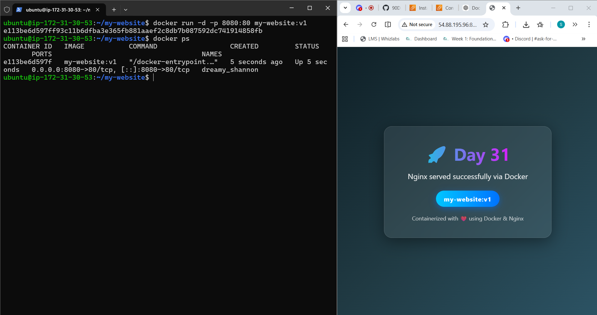 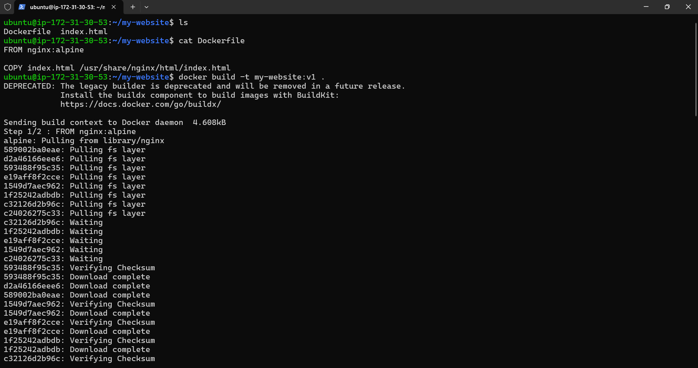 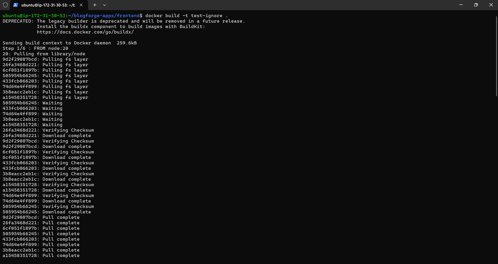 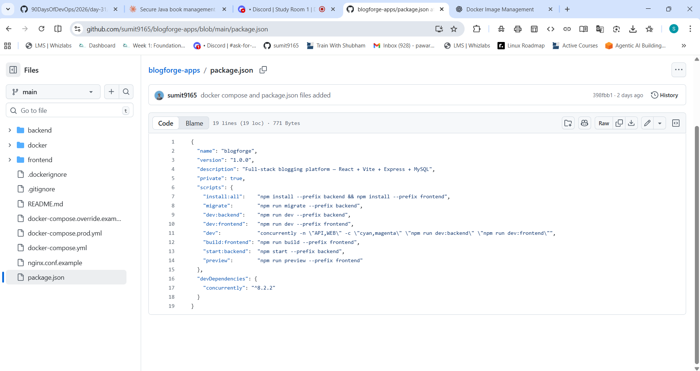 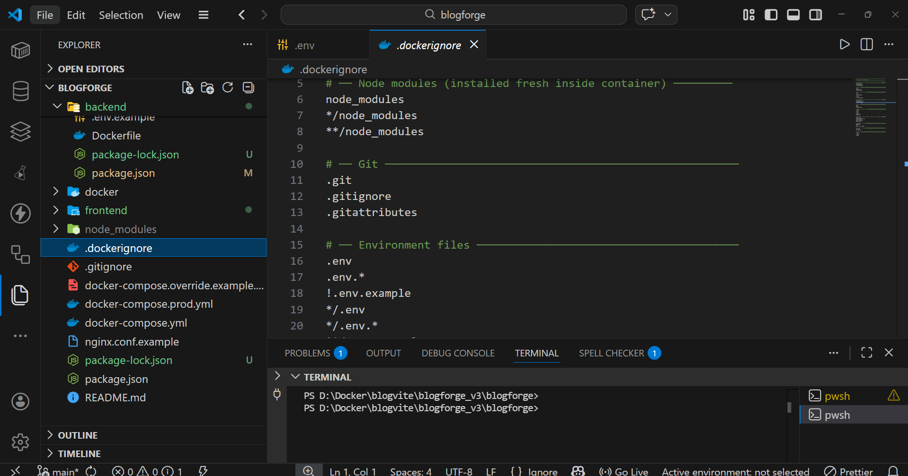 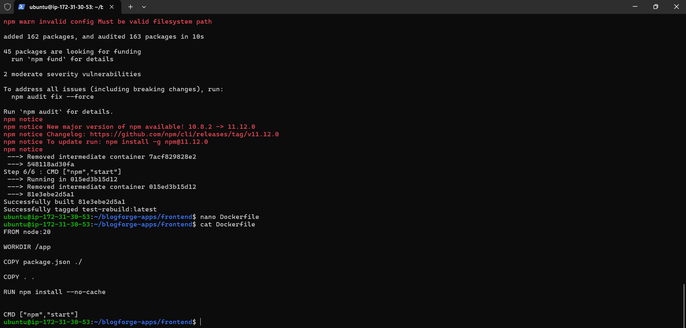 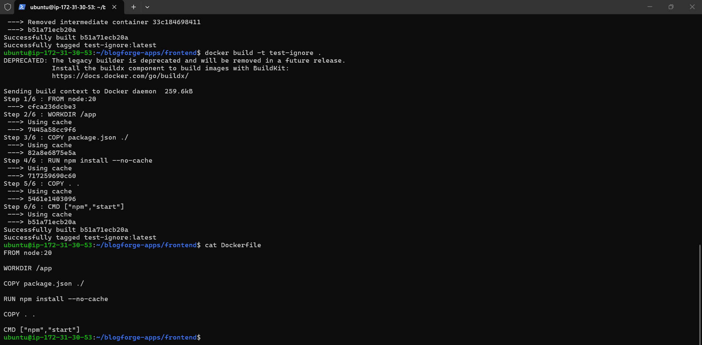 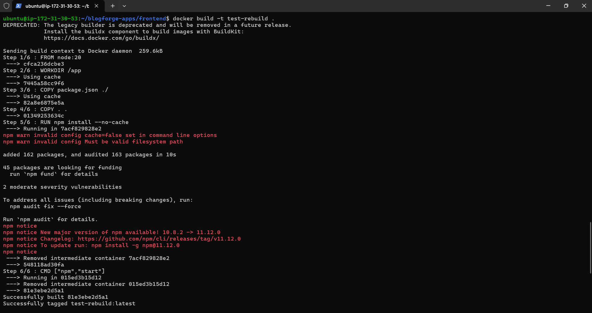 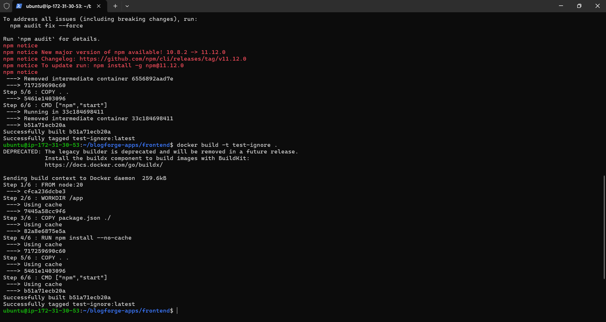